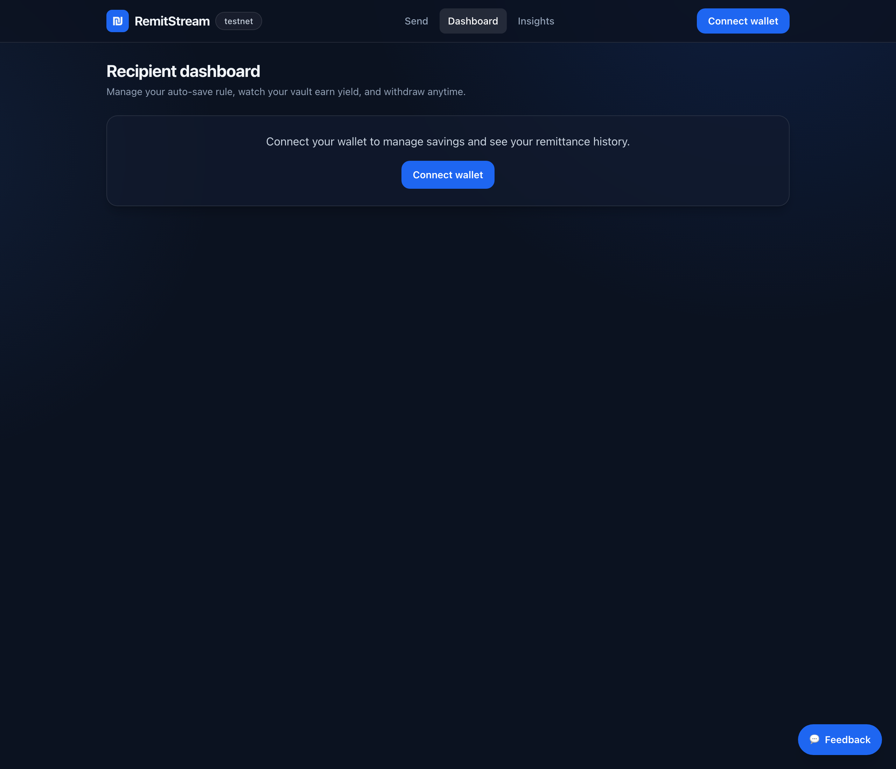
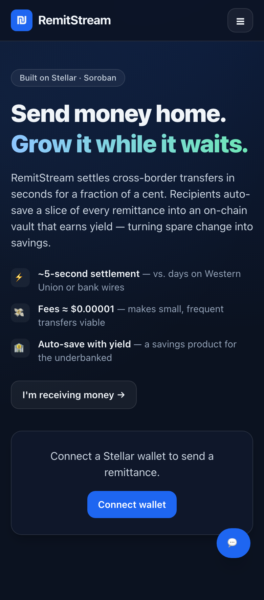

<div align="center">

# RemitStream

**Cross-border remittances with auto-save & yield, built on Stellar.**

Send money home in seconds for a fraction of a cent — and let the recipient
automatically save a slice of every transfer into an on-chain vault that earns yield.

[Live demo](#live-demo) · [Architecture](#architecture) · [Contracts](#deployed-contracts) · [Run locally](#run-it-locally)

</div>

---

## The problem

Migrant workers lose **6–8%** of every remittance to fees, and wait days for
settlement. Worse, on the receiving end the money is usually spent immediately —
recipients in emerging markets rarely have access to a savings product, let alone
one that earns yield.

Two problems, one transfer:

1. **Getting the money there** is slow and expensive.
2. **Keeping any of it** is nearly impossible.

## The solution

RemitStream settles transfers on Stellar (~5 seconds, ≈$0.00001 in fees) and puts
a savings product *inside the transfer itself*. The recipient sets a rule once —
"always save 20%" — and every incoming remittance is split automatically:

```
sender ──▶ AutoSplitRouter ──┬──▶ 80%  recipient's wallet   (spend / cash out)
                             └──▶ 20%  SavingsVault         (earns yield)
```

The recipient controls the rule. The sender cannot change it. Savings can be
withdrawn at any moment, yield included.

### Why this needs Stellar

Fees of ≈$0.00001 and ~5s finality are what make the model work at all. Migrant
workers typically send **$20–50 weekly**, not $500 monthly — a pattern
traditional rails cannot serve economically. Soroban then adds the piece
conventional remittance apps can't offer: a programmable savings vault that
intercepts the payment in-flight.

---

## Live demo

| | |
|---|---|
| **App** | _deploy to Vercel and add the URL here_ |
| **Network** | Stellar Testnet |
| **Demo video** | _add link_ |

> Need test funds? Connect a wallet and hit **Get test rUSDC** — the token
> contract has a built-in faucet, so no trustline setup is required.

### Screenshots

| Send flow | Recipient dashboard |
|---|---|
|  |  |

| Analytics & monitoring | Mobile |
|---|---|
|  |  |

_The Insights screenshot is populated with sample events to show the dashboard
layout; live figures come from real usage._

---

## Architecture

```
                      ┌──────────────────────────────┐
   Next.js app ──────▶│      AutoSplitRouter         │
   (wallet-signed)    │  route() · quote() · rules   │
                      └──────┬────────────────┬──────┘
                             │ payout         │ saved
                             ▼                ▼
                      recipient wallet   ┌─────────────┐
                                         │ SavingsVault │
                                         │  shares +    │
                                         │  yield       │
                                         └─────────────┘
```

### Contracts (Rust / Soroban)

| Contract | Responsibility |
|---|---|
| **`auto-split-router`** | Splits each incoming remittance per the recipient's rule, forwards the spendable part, pushes the rest into the vault, tracks lifetime stats. |
| **`savings-vault`** | Share-based vault. Yield is distributed by raising accounted assets without minting shares, so every holder gains pro rata and later deposits aren't diluted. |
| **`remit-token`** | SEP-41 test stablecoin (rUSDC) with a rate-limited faucet. Balances live in contract storage, so pilot users receive funds with **no trustline setup**. |

**Design decisions worth calling out:**

- **The recipient owns the savings rule.** `set_rule` requires the recipient's
  own signature — a sender can never dictate how much someone else saves.
- **The vault verifies its own funding.** `credit()` re-checks the vault's actual
  token balance against accounted assets, so even a compromised router cannot
  mint shares out of thin air.
- **Rounding always favours the protocol's solvency.** Withdrawal share burn
  rounds *up*; the router's split truncates in the recipient's favour and never
  retains a residue (`payout + saved == amount`, always).
- **Single signature per remittance.** The router pulls the full amount once and
  fans it out, keeping the auth tree shallow.

### Frontend (Next.js 16 · React 19 · Tailwind)

- Typed contract clients generated from the deployed contracts, vendored into
  `web/src/bindings` so there's no separate package build step.
- Multi-wallet support via Stellar Wallets Kit (Freighter, xBull, Albedo,
  Lobstr, hardware wallets).
- Live split preview: before confirming, the sender sees exactly what the
  recipient will receive and save — quoted from the chain, not guessed.
- Skeleton loading states, toast notifications, an error boundary that reports
  to the monitoring endpoint, and human-readable contract errors
  (`humanizeError` maps panics to sentences users can act on).

### Analytics, monitoring & feedback

All first-party, no third-party account required:

| Endpoint | Purpose |
|---|---|
| `POST /api/track` | Product events (sends, rule changes, faucet claims) |
| `POST /api/monitor` | Client error reports from the error boundary |
| `POST /api/feedback` · `GET` | In-app feedback widget + public summary |
| `GET /api/insights` | Aggregates all of the above for the dashboard |

Pageview and web-vitals monitoring comes from `@vercel/analytics`. The
`/insights` page renders volume, adoption, error rates, and feedback in one view.

---

## Deployed contracts

Stellar **Testnet** — see [`deployments.json`](deployments.json).

| Contract | Address |
|---|---|
| AutoSplitRouter | [`CAUHITYG2QOBX25HBP5NSGV4YJGJWIKFU5RAKIB5YC7IU6ZPBPUHFY4L`](https://stellar.expert/explorer/testnet/contract/CAUHITYG2QOBX25HBP5NSGV4YJGJWIKFU5RAKIB5YC7IU6ZPBPUHFY4L) |
| SavingsVault | [`CCF36HNGIGLQYCZYACJDLKKV42X4U7UXRAEDCOU3MTYYP7HLKOREMO3Y`](https://stellar.expert/explorer/testnet/contract/CCF36HNGIGLQYCZYACJDLKKV42X4U7UXRAEDCOU3MTYYP7HLKOREMO3Y) |
| rUSDC token | [`CD3TKICZQDPXPOYDFZW4JFHX5AT7VFK2VJZQE22Q4CYZQKYDVLW2ZFP2`](https://stellar.expert/explorer/testnet/contract/CD3TKICZQDPXPOYDFZW4JFHX5AT7VFK2VJZQE22Q4CYZQKYDVLW2ZFP2) |

**Proof of wallet interactions:** [`docs/USER_PROOF.md`](docs/USER_PROOF.md) —
generated directly from ledger state, every row independently verifiable.

---

## Run it locally

### Prerequisites

- Rust + `wasm32v1-none` target
- Stellar CLI **27+** (testnet runs protocol 27)
- Node 20+

### Contracts

```bash
cd contracts
cargo test          # 43 tests
stellar contract build
```

### Deploy your own instance

```bash
stellar keys generate remitstream-admin --network testnet --fund
./scripts/deploy.sh testnet remitstream-admin
```

This builds, deploys, initializes, and wires all three contracts, then writes
`deployments.json`, which the web app reads.

### Web app

```bash
cd web
npm install
npm run dev          # http://localhost:3000
```

To point the app at your own deployment, set `NEXT_PUBLIC_ROUTER_ID`,
`NEXT_PUBLIC_VAULT_ID`, and `NEXT_PUBLIC_TOKEN_ID` (see `web/src/lib/config.ts`).

### Onboard a pilot cohort

```bash
./scripts/onboard.sh 12 testnet   # real on-chain txs per wallet
node scripts/proof.mjs            # regenerate docs/USER_PROOF.md
```

---

## Testing

43 contract tests covering the money-movement paths and their failure modes:

| Suite | Tests | Highlights |
|---|---|---|
| `savings-vault` | 15 | pro-rata yield, dilution, rounding solvency, cross-user isolation, unauthorized `credit` |
| `auto-split-router` | 14 | split correctness, rounding residue, per-recipient rule isolation, compounding, self-transfer rejection |
| `remit-token` | 14 | transfers, allowance expiry, faucet rate limiting |

```bash
cd contracts && cargo test
```

---

## Roadmap

- **Now (MVP):** one corridor, testnet, manual yield accrual, faucet-funded rUSDC.
- **Next:** SEP-24 anchor integration for real fiat on/off-ramp; path payments so
  the sender pays in their currency and the recipient receives in theirs, atomically.
- **Then:** live yield via an existing Stellar DeFi protocol (e.g. Blend),
  recurring remittances, savings goals ("school fees"), and a small credit line
  against vault balance.

## License

MIT
