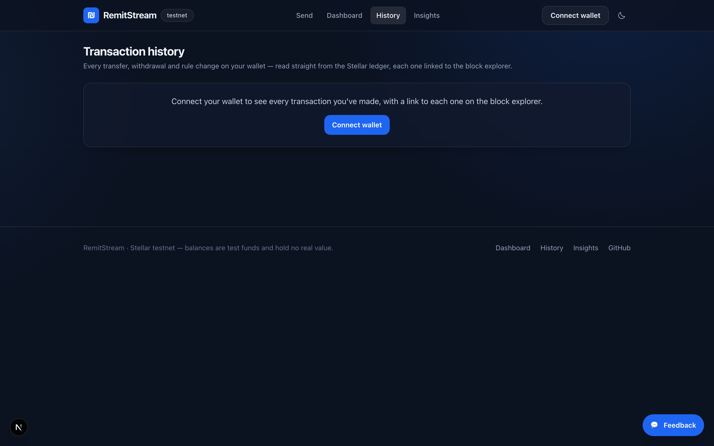

<div align="center">

# RemitStream

**Cross-border remittances with auto-save & yield, built on Stellar.**

Send money home in seconds for a fraction of a cent — and let the recipient
automatically save a slice of every transfer into an on-chain vault that earns yield.

[Live demo](#live-demo) · [What changed from user feedback](#what-pilot-users-asked-for)
· [Proof of usage](#proof-of-usage) · [Architecture](#architecture) · [Run locally](#run-it-locally)

</div>

---

## The problem

Migrant workers lose **6–8%** of every remittance to fees, and wait days for
settlement. Worse, on the receiving end the money is usually spent immediately —
recipients in emerging markets rarely have access to a savings product, let alone
one that earns yield.

Two problems, one transfer:

1. **Getting the money there** is slow and expensive.
2. **Keeping any of it** is nearly impossible.

## The solution

RemitStream settles transfers on Stellar (~5 seconds, ≈$0.00001 in fees) and puts
a savings product *inside the transfer itself*. The recipient sets a rule once —
"always save 20%" — and every incoming remittance is split automatically:

```
sender ──▶ AutoSplitRouter ──┬──▶ 80%  recipient's wallet   (spend / cash out)
                             └──▶ 20%  SavingsVault         (earns yield)
```

The recipient controls the rule. The sender cannot change it. Savings can be
withdrawn at any moment, yield included.

### Why this needs Stellar

Fees of ≈$0.00001 and ~5s finality are what make the model work at all. Migrant
workers typically send **$20–50 weekly**, not $500 monthly — a pattern
traditional rails cannot serve economically. Soroban then adds the piece
conventional remittance apps can't offer: a programmable savings vault that
intercepts the payment in-flight.

---

## Live demo

| | |
|---|---|
| **App** | https://remit-stream.vercel.app/ |
| **Network** | Stellar Testnet |
| **Demo video** | https://www.loom.com/share/3096850b52a14db092b3ef6c6c4e627c |
| **Pitch deck** | [`docs/RemitStream-Pitch.pptx`](docs/RemitStream-Pitch.pptx) |
| **Feedback form** | [Google Form responses](https://docs.google.com/spreadsheets/d/1qWlgaFwnT-XQyprBxDzJ1d5r18-J3qXOimasJRg_o3U/edit?resourcekey=&gid=146620607#gid=146620607) |

> Need test funds? Connect a wallet and hit **Get test rUSDC** — the token
> contract has a built-in faucet, so no trustline setup is required.

### Screenshots

| Landing & send flow | Recipient dashboard |
|---|---|
|  |  |

| Transaction history | Analytics & monitoring |
|---|---|
|  |  |

| Mobile |
|---|
|  |

---

## What pilot users asked for

Ten testers filled in the feedback form. Everything below was raised by a real
user and is closed in this release — each row links to the commit that did it.

| What they said | What shipped | Commit |
|---|---|---|
| *"A dedicated transaction history section where users can view and track their past transactions."* | A `/history` page built from two chain sources: Horizon for everything the wallet signed, and the router's own settlement events for incoming transfers that Horizon can never show. | [`05f70f5`](../../commit/05f70f5) |
| *"When I sent money out I'm supposed to be seeing the transaction link of the withdrawal."* <br> *"I do not see a transaction block explorer link… I had to fetch it from Freighter. Maybe you can place it in the confirmation message of money delivered."* | Every action returns its transaction hash. The send confirmation leads with an explorer link, and success toasts for sends, withdrawals, rule changes and faucet claims all carry one. | [`8943fea`](../../commit/8943fea) |
| *"The Insights page should also display real-time data, as the current data appears to be hardcoded."* | It was reading an append-only file that, on a serverless host, resets on every redeploy. Money figures now come from the router's settlement events and the vault contract itself. | [`4126f33`](../../commit/4126f33) |
| *"When the session expires, the UI still shows that the account is connected… automatically disconnect when the session expires or after inactivity."* | Sessions are revalidated against the wallet on restore, on refocus and after a signing failure, and dropped after 30 idle minutes. | [`fca7ef4`](../../commit/fca7ef4) |
| *"There should be an onboarding feature to guide and introduce new users."* <br> *"Help users who are new or less familiar with Web3 understand how the application works."* | A three-card welcome guide in plain language, plus a getting-started checklist that reads its progress from chain state rather than local flags. | [`cc9d415`](../../commit/cc9d415) |
| *"Deployment details, such as the contract address, should not be exposed directly within the application UI."* | Removed from the Insights page. They live here and in `deployments.json`. | [`4126f33`](../../commit/4126f33) |
| *"The UI could also be improved, as it currently feels too basic."* | Landing page rebuilt around one clear path, emoji illustrations replaced with a proper icon set, and two layout bugs fixed — a header control that hung out of line, and two identical connect buttons stacked on top of each other. | [`99f6af8`](../../commit/99f6af8) |

### Raised, and deliberately not built

Being straight about the rest of the feedback:

| Request | Why not, and what happens instead |
|---|---|
| **Two-factor authentication** | RemitStream is non-custodial — there is no account and no password to protect. Authentication *is* the wallet signature, and 2FA belongs to the wallet. Adding an app-level second factor would imply a security guarantee the architecture does not provide. |
| **Google sign-in** | Same reason. A Google account cannot authorise a Stellar transaction; adding it would create the impression of a custodial account that does not exist. |
| **AI chat support** | Real, but not the bottleneck the same testers described. The onboarding guide and checklist address the underlying "I don't know what to do next" problem directly. |
| **Support for XLM and other tokens** | Genuinely wanted and on the roadmap. It needs the router and vault to be asset-generic, which is a contract change and a redeploy, not a UI change. |
| **Fully implemented yield** | The vault's accounting is real — yield is distributed by raising accounted assets without minting shares, so holders gain pro rata. What is missing is a *source* of yield, which means integrating a lending market such as Blend. Until then the share price honestly sits at 1.0000 rather than displaying an invented APY. |

---

## Proof of usage

[`docs/USER_PROOF.md`](docs/USER_PROOF.md) is generated end to end by
[`scripts/proof.mjs`](scripts/proof.mjs), which reads the testnet ledger. Nothing
in it is typed by hand.

| Metric | Value |
|---|---|
| Wallets with on-chain activity | **22** |
| Signed contract operations | **116** |
| Remittances settled | **47** |
| Volume routed | **3,522.00 rUSDC** |
| Auto-saved into the vault | **371.20 rUSDC** |

Each wallet is measured two ways, because neither view is complete on its own:
Horizon shows what an account *signed*, while the router and vault contracts show
what it *received* — an incoming transfer never appears in the recipient's own
Horizon history, because rUSDC balances live in contract storage rather than in
classic trustlines.

**On the 50-user requirement — stated plainly:** this is 22 wallets, not 50, and
of those, 12 are pilot testers while 10 were operated by the author while testing
the flow end to end. `USER_PROOF.md` keeps the two groups in separate tables and
does not count builder wallets as users. Reaching 50 genuine testers is an
onboarding problem, not a reporting one, and inflating the number here would make
every other figure in this repository worth less.

```bash
node scripts/proof.mjs     # regenerate from current ledger state
```

---

## Architecture

```
                      ┌──────────────────────────────┐
   Next.js app ──────▶│      AutoSplitRouter         │
   (wallet-signed)    │  route() · quote() · rules   │
                      └──────┬────────────────┬──────┘
                             │ payout         │ saved
                             ▼                ▼
                      recipient wallet   ┌─────────────┐
                                         │ SavingsVault │
                                         │  shares +    │
                                         │  yield       │
                                         └─────────────┘
```

### Contracts (Rust / Soroban)

| Contract | Responsibility |
|---|---|
| **`auto-split-router`** | Splits each incoming remittance per the recipient's rule, forwards the spendable part, pushes the rest into the vault, tracks lifetime stats. Emits a `Routed` event the app reads back for history and analytics. |
| **`savings-vault`** | Share-based vault. Yield is distributed by raising accounted assets without minting shares, so every holder gains pro rata and later deposits aren't diluted. |
| **`remit-token`** | SEP-41 test stablecoin (rUSDC) with a rate-limited faucet. Balances live in contract storage, so pilot users receive funds with **no trustline setup**. |

**Design decisions worth calling out:**

- **The recipient owns the savings rule.** `set_rule` requires the recipient's
  own signature — a sender can never dictate how much someone else saves.
- **The vault verifies its own funding.** `credit()` re-checks the vault's actual
  token balance against accounted assets, so even a compromised router cannot
  mint shares out of thin air.
- **Rounding always favours the protocol's solvency.** Withdrawal share burn
  rounds *up*; the router's split truncates in the recipient's favour and never
  retains a residue (`payout + saved == amount`, always).
- **Single signature per remittance.** The router pulls the full amount once and
  fans it out, keeping the auth tree shallow.

### Frontend (Next.js 16 · React 19 · Tailwind)

- Typed contract clients generated from the deployed contracts, vendored into
  `web/src/bindings` so there's no separate package build step.
- Multi-wallet support via Stellar Wallets Kit (Freighter, xBull, Albedo,
  Lobstr, hardware wallets), with sessions revalidated against the wallet rather
  than trusted from local storage.
- Live split preview: before confirming, the sender sees exactly what the
  recipient will receive and save — quoted from the chain, not guessed.
- Skeleton loading states, toast notifications, an error boundary that reports
  to the monitoring endpoint, and human-readable contract errors
  (`humanizeError` maps panics to sentences users can act on).

### Reading history off the chain

There is no application database. History is reconciled from two sources, which
is worth understanding before changing that code:

| Source | Covers | Retention |
|---|---|---|
| Horizon operations | Everything a wallet **signed** — sends, withdrawals, rule changes, faucet claims | Full |
| Router `Routed` events | **Incoming** remittances, plus the payout/saved split | ~7 days (RPC event window) |

The Soroban RPC only pages forward and walks roughly 10k ledgers per call, so
covering the retention window takes about a dozen sequential round trips. That
scan runs server-side in `/api/routed` as parallel ledger chunks behind a 30s
cache, shared across visitors instead of repeated per page load. The history page
renders as soon as the signed half arrives and folds incoming transfers in when
the scan lands.

### Analytics, monitoring & feedback

| Endpoint | Purpose | Source |
|---|---|---|
| `GET /api/routed` | Every settled remittance in the RPC's event window | Chain |
| `GET /api/insights` | Volume, participants, vault state, error and feedback counts | Chain + first-party |
| `POST /api/track` | Product events (sends, rule changes, faucet claims) | First-party |
| `POST /api/monitor` | Client error reports from the error boundary | First-party |
| `POST /api/feedback` · `GET` | In-app feedback widget + public summary | First-party |

Money figures are read from the ledger. Error reports and in-app ratings are
first-party and reset when the app is redeployed — the Insights page says so
rather than presenting them as lifetime totals.

---

## Deployed contracts

Stellar **Testnet** — see [`deployments.json`](deployments.json).

| Contract | Address |
|---|---|
| AutoSplitRouter | [`CAUHITYG2QOBX25HBP5NSGV4YJGJWIKFU5RAKIB5YC7IU6ZPBPUHFY4L`](https://stellar.expert/explorer/testnet/contract/CAUHITYG2QOBX25HBP5NSGV4YJGJWIKFU5RAKIB5YC7IU6ZPBPUHFY4L) |
| SavingsVault | [`CCF36HNGIGLQYCZYACJDLKKV42X4U7UXRAEDCOU3MTYYP7HLKOREMO3Y`](https://stellar.expert/explorer/testnet/contract/CCF36HNGIGLQYCZYACJDLKKV42X4U7UXRAEDCOU3MTYYP7HLKOREMO3Y) |
| rUSDC token | [`CD3TKICZQDPXPOYDFZW4JFHX5AT7VFK2VJZQE22Q4CYZQKYDVLW2ZFP2`](https://stellar.expert/explorer/testnet/contract/CD3TKICZQDPXPOYDFZW4JFHX5AT7VFK2VJZQE22Q4CYZQKYDVLW2ZFP2) |

---

## Run it locally

### Prerequisites

- Rust + `wasm32v1-none` target
- Stellar CLI **27+** (testnet runs protocol 27)
- Node 20+

### Contracts

```bash
cd contracts
cargo test          # 43 tests
stellar contract build
```

### Deploy your own instance

```bash
stellar keys generate remitstream-admin --network testnet --fund
./scripts/deploy.sh testnet remitstream-admin
```

This builds, deploys, initializes, and wires all three contracts, then writes
`deployments.json`, which the web app reads.

### Web app

```bash
cd web
npm install
npm run dev          # http://localhost:3000
```

To point the app at your own deployment, set `NEXT_PUBLIC_ROUTER_ID`,
`NEXT_PUBLIC_VAULT_ID`, and `NEXT_PUBLIC_TOKEN_ID` (see `web/src/lib/config.ts`).

### Regenerate the docs

```bash
node scripts/proof.mjs                     # docs/USER_PROOF.md, from the ledger

python3 -m venv .venv                      # docs/RemitStream-Pitch.pptx
.venv/bin/pip install python-pptx
.venv/bin/python scripts/build-deck.py
```

The deck reads its traction figures out of `USER_PROOF.md`, so regenerate the
proof first and the two can't disagree.

---

## Testing

43 contract tests covering the money-movement paths and their failure modes:

| Suite | Tests | Highlights |
|---|---|---|
| `savings-vault` | 15 | pro-rata yield, dilution, rounding solvency, cross-user isolation, unauthorized `credit` |
| `auto-split-router` | 14 | split correctness, rounding residue, per-recipient rule isolation, compounding, self-transfer rejection |
| `remit-token` | 14 | transfers, allowance expiry, faucet rate limiting |

```bash
cd contracts && cargo test
```

---

## Roadmap

Ordered by what unblocks real money moving through the product.

1. **SEP-24 anchor integration** — real fiat on/off ramp, so a corridor carries
   actual value instead of test tokens.
2. **Live yield via Blend** — replace manual accrual with a real Stellar lending
   market, so vault balances earn without intervention.
3. **Path payments** — the sender pays in their currency and the recipient
   receives in theirs, atomically.
4. **Savings goals and recurring sends** — "school fees by September". Goals are
   the retention mechanic the vault makes possible.
5. **Multi-asset support** — requested by pilot users; accept XLM and other
   Stellar assets, not just rUSDC.
6. **Credit line against vault balance** — small advances secured by savings.

### Next phase, driven by this round of feedback

The remaining unaddressed requests set the agenda for the next release:
asset-generic contracts so XLM and other tokens work, a real yield source behind
the vault, and a push to onboard testers past the 22 wallets currently verifiable
on-chain. The onboarding guide added here is the first half of that push — the
second is recruiting through diaspora community groups rather than one wallet at
a time.

## License

MIT
